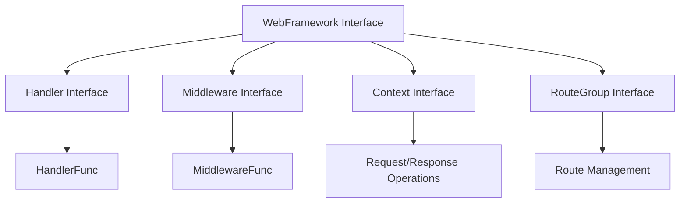
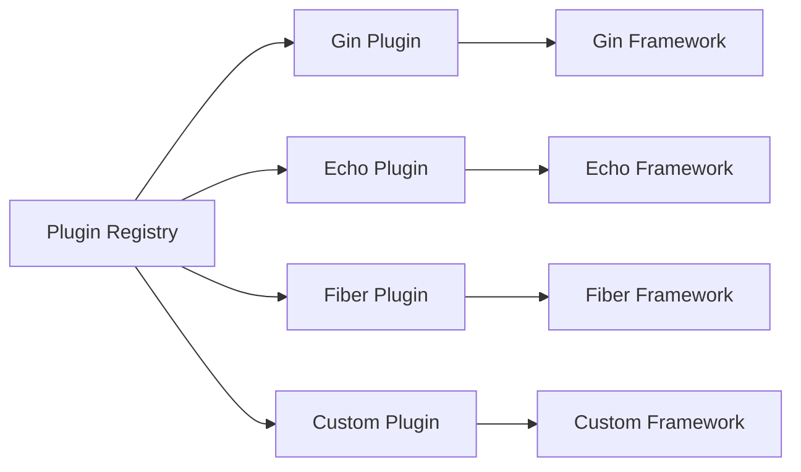
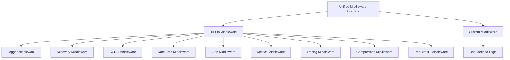
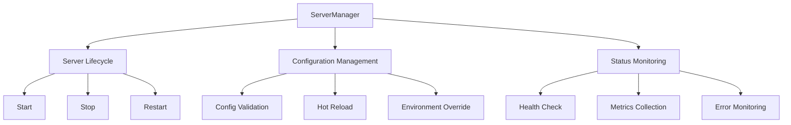

# 模块概述

Server 模块为 lmcc-go-sdk 提供了统一的 Web 框架接口，支持多种主流框架并提供插件化架构。

## 设计理念

### 框架无关性

Server 模块的核心理念是提供**框架无关**的统一接口，让开发者能够：

- **统一 API**: 无论使用 Gin、Echo 还是 Fiber，都使用相同的接口
- **简化切换**: 框架切换只需修改配置，代码逻辑保持不变
- **降低学习成本**: 掌握一套 API 即可操作多种框架

### 插件化架构

采用插件化设计模式，实现高度的模块化和可扩展性：

```go
// 插件接口设计 (Plugin interface design)
type FrameworkPlugin interface {
    Name() string
    CreateFramework(config interface{}, services services.ServiceContainer) (WebFramework, error)
    ValidateConfig(config interface{}) error
}

// 统一框架接口 (Unified framework interface)
type WebFramework interface {
    Start(ctx context.Context) error
    Stop(ctx context.Context) error
    RegisterRoute(method, path string, handler Handler) error
    RegisterMiddleware(middleware Middleware) error
}
```

### 配置驱动

通过声明式配置管理所有服务器行为：

```yaml
# 框架选择和基础配置 (Framework selection and basic configuration)
framework: gin
host: 0.0.0.0
port: 8080
mode: debug

# 功能配置 (Feature configuration)
cors:
  enabled: true
  allow-origins: ["*"]

middleware:
  logger:
    enabled: true
    format: json
  recovery:
    enabled: true
```

## 架构组件

### 1. 核心抽象层



**核心接口职责**：
- `WebFramework`: 服务器生命周期管理和路由注册
- `Handler`: 请求处理逻辑
- `Middleware`: 请求/响应拦截处理
- `Context`: 请求上下文和响应操作
- `RouteGroup`: 路由分组和嵌套管理

### 2. 插件系统



**插件系统特性**：
- **动态注册**: 运行时注册和发现插件
- **配置验证**: 插件特定的配置验证
- **版本管理**: 支持插件版本信息和兼容性检查
- **扩展性**: 支持自定义框架插件开发

### 3. 中间件生态



**中间件特性**：
- **统一接口**: 所有中间件使用相同的接口定义
- **链式处理**: 支持中间件链的顺序执行
- **框架适配**: 自动适配不同框架的中间件机制
- **配置驱动**: 通过配置文件控制中间件行为

### 4. 服务管理层



**管理功能**：
- **生命周期控制**: 统一的启动、停止和重启接口
- **配置管理**: 配置验证、热重载和环境变量覆盖
- **状态监控**: 健康检查、指标收集和错误监控
- **优雅关闭**: 支持信号处理和优雅关闭流程

## 核心特性

### 1. 多框架支持

| 框架 | 版本要求 | 特色功能 | 性能特点 |
|------|----------|----------|----------|
| **Gin** | v1.9.0+ | 轻量级，中间件丰富 | 高性能，低内存占用 |
| **Echo** | v4.10.0+ | 标准库风格，功能完整 | 均衡性能，易用性好 |
| **Fiber** | v2.48.0+ | Express.js 风格，快速开发 | 极高性能，现代化 API |

### 2. 统一中间件系统

所有框架共享相同的中间件接口和配置：

```go
// 统一中间件接口 (Unified middleware interface)
type Middleware interface {
    Process(ctx Context, next func() error) error
}

// 使用示例 (Usage example)
server.RegisterMiddleware(middleware.Logger())
server.RegisterMiddleware(middleware.Recovery())
server.RegisterMiddleware(middleware.CORS())
```

### 3. 灵活的路由管理

支持路由组、嵌套分组和中间件链：

```go
// 路由组示例 (Route group example)
api := server.Group("/api/v1")
api.RegisterMiddleware(middleware.Auth())

users := api.Group("/users")
users.RegisterRoute("GET", "/", userHandler.List)
users.RegisterRoute("POST", "/", userHandler.Create)
users.RegisterRoute("GET", "/:id", userHandler.Get)
```

### 4. 完整的配置管理

支持多种配置源和热重载：

```go
// 配置加载示例 (Configuration loading example)
config := server.DefaultServerConfig()
config.Framework = "gin"
config.Port = 8080
config.CORS.Enabled = true

// 配置验证 (Configuration validation)
if err := config.Validate(); err != nil {
    log.Fatal("Invalid configuration", err)
}
```

## 与其他模块集成

### Config 模块集成

```go
// 从配置文件加载服务器配置 (Load server config from file)
var serverConfig server.ServerConfig
if err := cfg.UnmarshalKey("server", &serverConfig); err != nil {
    return err
}
```

### Log 模块集成

```go
// 使用统一日志记录 (Use unified logging)
server.RegisterMiddleware(middleware.Logger(
    middleware.WithLogger(logger),
    middleware.WithFormat("json"),
))
```

### Errors 模块集成

```go
// 统一错误处理 (Unified error handling)
server.RegisterMiddleware(middleware.Recovery(
    middleware.WithErrorHandler(func(ctx server.Context, err error) {
        apiErr := errors.WithCode(err, errors.CodeInternalError)
        ctx.JSON(apiErr.HTTPStatus(), apiErr)
    }),
))
```

## 使用场景

### 1. 微服务开发

适用于构建高性能的微服务应用：

- **服务发现集成**: 与服务注册中心集成
- **分布式追踪**: 自动生成追踪信息
- **健康检查**: 内置健康检查端点
- **指标暴露**: 自动暴露 Prometheus 指标

### 2. API 网关

作为 API 网关的核心组件：

- **路由转发**: 灵活的路由规则配置
- **认证授权**: 多种认证方式支持
- **限流熔断**: 内置限流和熔断机制
- **协议转换**: 支持多种协议适配

### 3. Web 应用

构建传统的 Web 应用：

- **模板渲染**: 支持多种模板引擎
- **静态文件**: 高效的静态文件服务
- **会话管理**: 灵活的会话存储选项
- **安全防护**: 内置安全中间件

### 4. 开发和测试

简化开发和测试流程：

- **热重载**: 配置文件自动重载
- **测试支持**: 内置测试工具和 Mock 支持
- **调试模式**: 详细的调试信息输出
- **性能分析**: 内置性能分析工具

## 最佳实践

### 1. 配置管理

```go
// 推荐：使用环境变量覆盖配置 (Recommended: Use environment variables to override config)
config := server.DefaultServerConfig()
config.Host = os.Getenv("SERVER_HOST")
if port, err := strconv.Atoi(os.Getenv("SERVER_PORT")); err == nil {
    config.Port = port
}
```

### 2. 错误处理

```go
// 推荐：统一错误处理中间件 (Recommended: Unified error handling middleware)
server.RegisterMiddleware(func(ctx server.Context, next func() error) error {
    if err := next(); err != nil {
        logger.Error("Request failed", log.Error(err))
        return ctx.JSON(500, map[string]string{"error": "Internal server error"})
    }
    return nil
})
```

### 3. 中间件顺序

```go
// 推荐：合理的中间件顺序 (Recommended: Proper middleware order)
server.RegisterMiddleware(middleware.Recovery())   // 1. 错误恢复
server.RegisterMiddleware(middleware.Logger())     // 2. 请求日志
server.RegisterMiddleware(middleware.CORS())       // 3. 跨域处理
server.RegisterMiddleware(middleware.RateLimit())  // 4. 限流控制
server.RegisterMiddleware(middleware.Auth())       // 5. 身份验证
```

## 性能特性

### 1. 零拷贝设计

- **内存优化**: 最小化内存分配和拷贝
- **对象池**: 复用常用对象减少 GC 压力
- **流式处理**: 支持大文件的流式传输

### 2. 并发安全

- **无锁设计**: 关键路径避免锁竞争
- **协程安全**: 所有接口都是协程安全的
- **资源管理**: 自动管理连接和资源生命周期

### 3. 可观测性

- **指标暴露**: 自动暴露关键性能指标
- **分布式追踪**: 与主流追踪系统集成
- **健康检查**: 多层次的健康状态检查

## 下一步

- 查看 [快速开始指南](01_quick_start.md) 学习基本使用
- 了解 [配置管理](02_configuration.md) 详细说明
- 探索 [框架插件](03_framework_plugins.md) 功能
- 学习 [中间件系统](04_middleware_system.md) 使用
- 掌握 [服务器管理](05_server_management.md) 技巧
